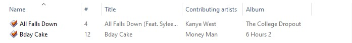
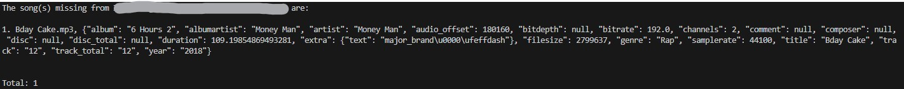

# MP3Comparer

## Description

Finds MP3s missing when comparing two folders and copies over missing files if prompted. Also finds MP3s that are missing tag data (view "Details" below for what "missing tag data" is defined as)

Example of folder comparison:

- folder 1:\
  
- folder 2:\
  
- result of comparing folder 2 to 1:\
  

## Details

Missing tag data is defined as songs missing one of the following: album, album artist, artist, genre, title, track, or year.

## Requirements

Python 3.1 or greater (version requirement provided by [Vermin](https://pypi.org/project/vermin/))\
[tinytag](https://pypi.org/project/tinytag/)
